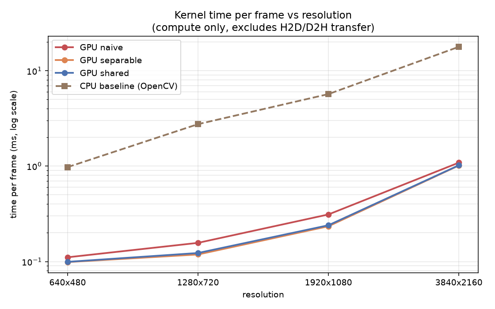
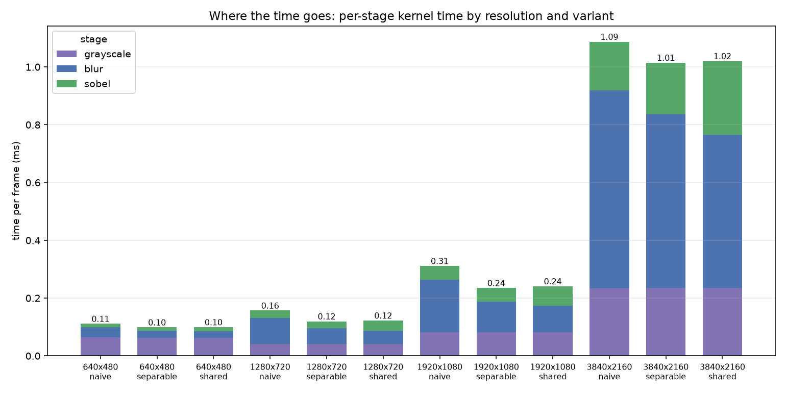

# FrameFlow — GPU-Accelerated Video Processing Pipeline

A CUDA C++ pipeline that decodes a video, runs **BGR → grayscale → Gaussian blur → Sobel edge detection** entirely on the GPU, and encodes the result. Every image operation is a hand-written `__global__` kernel; OpenCV is used only for video I/O and as the CPU baseline.

The point of the project is not the pipeline — it is the **measured optimization progression**: a naive kernel, an algorithmic improvement, and a memory-hierarchy optimization, each benchmarked against the last, with the gaps between theory and measurement explained rather than glossed over.


*Final pipeline output, 1920×1080. Shape outlines are crisp, interiors are black, and the smooth background gradient correctly produces near-zero response.*

---

## Results at a glance

Measured on an **RTX 5060 Laptop GPU** (Blackwell, `sm_120`, 26 SMs, 48 KB shared memory/block), CUDA 12.8, MSVC 19.44, Release build.

| Metric (1920×1080, 5×5 blur, `shared` variant) | Time/frame | Rate |
|---|---|---|
| Kernel time (compute only) | **0.319 ms** | 3,134 fps |
| GPU total (+ H2D/D2H transfer) | 1.170 ms | 855 fps |
| End-to-end (+ decode) | 8.811 ms | 113.5 fps |
| End-to-end (+ decode **and** encode) | 9.867 ms | **101.3 fps** |
| CPU baseline (OpenCV, multithreaded SIMD) | 5.686 ms | 176 fps |

**On real-time:** the source clip is 30 fps and end-to-end throughput is **101.3 fps at 1080p**, so the full pipeline runs at roughly **3.4× real-time** on this hardware. That figure includes CPU video decode and encode. The kernel-only figure of 3,134 fps describes GPU processing throughput, not pipeline throughput — the two are 10× apart and should never be quoted interchangeably. End-to-end 4K was not measured (no 4K source clip); the 4K numbers below are compute-only, from resized frames.

---

## Why CUDA?

A 1920×1080 frame is **2,073,600 pixels**. Each of the three stages computes one output per pixel, and every output is independent of every other:

- Grayscale: 3 multiply-adds per pixel
- Gaussian blur, 5×5 separable: 10 multiply-adds per pixel
- Sobel: 18 multiply-adds plus a square root per pixel

That is roughly **64 million arithmetic operations per frame**, and at 30 fps, **~1.9 billion per second** — with zero dependencies between pixels. This is the shape of problem a GPU exists for: enormous width, trivial per-element work, no coordination.

The interesting part is that this is *not* compute-bound. At 5×5, the naive kernel performs 25 memory loads per output pixel and 25 multiply-adds. On modern hardware the arithmetic is free and the loads are not, which is why every optimization in this project targets memory traffic rather than arithmetic.

---

## Architecture

```
Video Decode (CPU, OpenCV → BGR frames)
      ↓
  Host → Device                        cudaMemcpy2D, one upload per frame
      ↓
BGR → Grayscale Kernel                 d_bgr  → d_gray
      ↓
Blur Kernel  (naive | separable | shared+halo)    d_gray → d_blur
      ↓
Sobel Kernel (naive | shared+halo)     d_blur → d_edges
      ↓
  Device → Host                        one download per frame
      ↓
Video Encode (CPU)
```

Device buffers are allocated once and reused across every frame. No intermediate result returns to the host: the three kernels chain through device memory, so a frame crosses the PCIe bus exactly twice regardless of how many stages run.

---

## CUDA design

### Thread and block mapping

All kernels use **16×16 = 256-thread blocks** — a multiple of the 32-thread warp size, small enough to keep several blocks resident per SM for latency hiding.

`x` is mapped to `threadIdx.x` in every kernel. Images are row-major, so consecutive threads in a warp then access **consecutive addresses**, and the warp's loads coalesce into a small number of memory transactions. Mapping `x` to `threadIdx.y` instead would make each thread in a warp stride a full row apart, turning one coalesced access into 32 separate ones. This holds even in the vertical blur pass, where the *tile* is tall: consecutive threads still read consecutive columns of the same row.

Grid dimensions are rounded up, so the last block in each dimension runs threads past the image edge. Every kernel bounds-checks before reading or writing. The test suite deliberately includes resolutions that are **not** multiples of 16 (1000×996, 642×482), because clean power-of-two dimensions hide exactly this class of bug.

### Tile and halo geometry

A block computing a 16×16 output tile with a 5×5 filter needs a border of 2 extra pixels on every side — the **halo**. Worked example:

```
16×16 tile + 5×5 filter (radius 2)  →  20×20 shared region
                                        400 pixels loaded
                                        256 outputs produced
```

Because the tiled variant is also separable, the tiles are 1D-shaped rather than square, which is cheaper still:

| Pass | Shared tile | Floats | Bytes |
|---|---|---|---|
| Horizontal | (16 + 2·2) × 16 = 20×16 | 320 | 1,280 |
| Vertical | 16 × (16 + 2·2) = 16×20 | 320 | 1,280 |
| Sobel (radius 1) | 18×18 | 324 | 1,296 |

At **48 KB of shared memory per block** on this GPU, those tiles use under 3% of the budget. Occupancy here is bounded by other resources, not shared memory, so there is no reason to shrink the tile.

**Halo loading strategy.** Each thread loads one interior pixel, and low-index threads loop again to cover the halo, via a grid-stride loop over the tile extent:

```cuda
for (int i = threadIdx.x; i < tileW; i += blockDim.x)
```

With `blockDim.x = 16` and radius 2, `tileW = 20`: threads 0–15 load columns 0–15, then threads 0–3 loop again for columns 16–19. This was chosen over the common "each thread loads its own pixel, then threads 0..2R−1 load the halo" pattern because it needs no separate halo index arithmetic and cannot leave a gap when the tile exceeds twice the block width.

The `__syncthreads()` after loading is mandatory — thread 15 reads columns 15–19, written by other threads. It sits **outside** the bounds guard: every thread in a block must reach every barrier, and letting out-of-range threads return early would deadlock the block.

### Constant memory for filter weights

Filter weights are the textbook case for `__constant__` memory: small, read-only for the lifetime of a launch, and read *identically by every thread in a warp* (the tap index is warp-uniform). Constant memory is backed by a dedicated per-SM cache that broadcasts one value to the whole warp in a single transaction, instead of an L1 lookup per access consuming capacity that image data could use.

The measured effect is asymmetric, and the asymmetry is the informative part:

| ksize | naive | separable | shared |
|---|---|---|---|
| 5 | 1.06× | 1.04× | **1.10×** |
| 9 | 1.09× | 1.06× | **1.23×** |
| 15 | 1.10× | 1.08× | **1.39×** |
| 21 | 1.10× | 1.08× | **1.47×** |

Naive and separable gain a flat 6–10%. The tiled variant gains up to **47%**, because once image data is staged in shared memory the weight reads were the *only* global traffic left in the inner loop — so removing them removes a large fraction of what remained. In the naive kernel the same reads are lost among 25 image loads per pixel.

Sobel is unchanged: its 3×3 coefficients are compile-time literals that `nvcc` materialises as immediates, so there is no memory traffic to eliminate.

### Border handling

The CUDA kernels implement **`BORDER_REFLECT_101`**, matching OpenCV's convolution default, which mirrors about the edge pixel *without repeating it*:

```
row:            a b c d e
extended:   c b|a b c d e|d c
```

so index −1 maps to 1 and index *n* maps to *n*−2. Plain `REFLECT` would give `a b|a b c d e|e d`, repeating the edge sample and shifting every border pixel by one source sample.

This choice means validation compares the **entire image with zero excluded pixels**. The alternatives — telling OpenCV to use a simpler mode, or excluding borders from comparison — would both have been easier and weaker.

---

## Optimization progression

Each step below states what changed, the memory-traffic arithmetic that predicts the gain, the measured result, and why they differ.

### Step 1 — Naive: direct 2D convolution

Every thread reads all K² neighbours from global memory. For a 5×5 filter that is **25 global loads per output pixel**. A 16×16 block produces 256 outputs and therefore issues:

```
256 outputs × 25 loads = 6,400 global loads
distinct data actually touched: 20×20 = 400 pixels
redundancy factor: 16×
```

The same bytes cross the memory bus roughly sixteen times more often than strictly necessary.

**Measured, 1080p:** 0.182 ms.

### Step 2 — Separable: two 1D passes

A 2D Gaussian is the outer product of two 1D Gaussians, so the K×K convolution factors into a horizontal pass followed by a vertical one. Taps per output pixel fall from K² to 2K:

```
K=5:   25 → 10 taps   (predicted 2.5×)
K=9:   81 → 18 taps   (predicted 4.5×)
K=21: 441 → 42 taps   (predicted 10.5×)
```

This is an **algorithmic** win, independent of memory layout, and it composes with tiling rather than competing with it. It works *because the Gaussian is separable* — a general K×K filter has rank > 1 and cannot be factored this way.

**Measured blur time, 1920×1080:**

| ksize | naive | separable | measured | predicted (K/2) | ratio |
|---|---|---|---|---|---|
| 5 | 0.201 | 0.107 | 1.88× | 2.5× | 75% |
| 9 | 0.508 | 0.151 | 3.36× | 4.5× | 75% |
| 15 | 1.299 | 0.225 | 5.77× | 7.5× | 77% |
| 21 | 2.471 | 0.301 | 8.21× | 10.5× | 78% |

**Why measurement falls short of theory — and why it falls short *consistently*.** The speedup holds at 75–78% of the predicted K/2 at every kernel size, which makes it a systematic effect rather than noise. Three causes:

1. **The float intermediate.** Rounding between passes would quantize twice and make this variant disagree with the naive one by more than rounding, so the intermediate is `float`. It therefore moves 4 bytes per pixel where the naive kernel reads 1. This is a deliberate trade of some speed for numerical comparability between variants.
2. **Two launches instead of one.** Fixed per-launch overhead is paid twice.
3. **The naive kernel was never paying full price.** Its 25 loads per pixel overlap heavily with neighbouring threads, so the L1/L2 caches absorb most of the redundancy. The theoretical 2.5× assumes 25 *independent DRAM* loads, which was never what was happening.

Point 3 is the important one: **the cache is already performing an implicit version of the optimization**, which is exactly why the explicit one buys less than the arithmetic suggests.

### Step 3 — Shared memory + halo tiling

The block loads its tile plus halo into `__shared__` memory once, then every thread computes from on-chip memory.

**Measured blur speedup over naive, by resolution:**


| resolution | separable | shared |
|---|---|---|
| 640×480 | 1.43× | 1.56× |
| 1280×720 | 1.66× | 1.93× |
| 1920×1080 | 1.72× | **1.98×** |
| 3840×2160 | 1.14× | 1.29× |

And the benefit of tiling **grows with stencil size**, which is the reuse argument stated as a prediction and then confirmed:

| ksize | separable | shared | shared/separable |
|---|---|---|---|
| 5 | 0.107 | 0.094 | 1.14× |
| 9 | 0.151 | 0.106 | 1.42× |
| 15 | 0.225 | 0.122 | 1.84× |
| 21 | 0.301 | 0.152 | **1.98×** |

**Why the 4K case regresses.** At 3840×2160 the separable float intermediate is 33 MB and no longer fits in cache, so the extra traffic it introduces offsets more of what the tap reduction saves. The optimization is workload-dependent, and the sweep is what makes that visible — a single-resolution benchmark would have hidden it.

### The result that did not go as predicted: tiled Sobel is *slower*

| | naive | shared |
|---|---|---|
| Sobel, 1080p | **0.047 ms** | 0.068 ms |

Reproduced identically across three runs. The tile arithmetic looks favourable — 324 loads for 256 outputs versus 2,304 naive loads — but a 3×3 stencil has far less overlap between neighbouring threads than a 5×5, and its redundant reads already hit L1. Staging through shared memory replaces cheap cache hits with an explicit load loop, a `uint8`→`float` conversion, and a **block-wide barrier that serializes the block**.

This is the same reuse argument that explains the blur result, applied to a case where it predicts no benefit — and it is reported rather than removed. The consequence is that the `shared` variant is marginally *slower overall* than `separable` (0.240 ms vs 0.234 ms kernel total at 1080p), because the Sobel regression cancels the blur gain. **The fastest measured combination is shared-memory blur with naive Sobel.**

---

## Validation

GPU output is checked two independent ways.

**1. Against OpenCV** (`--validate`), which is the performance baseline and a tolerance-based reference. Matched parameters: same kernel size, same sigma, same `BORDER_REFLECT_101`.

```
Validation  (20 frames, 1920x1080, GPU vs OpenCV CPU baseline)
Border pixels excluded: 0 (full-image comparison, 2073600 px/frame)
Tolerance: mean absolute error <= 1.0 on an 8-bit scale

stage            mean abs      max abs  px differing >1
Grayscale         0.00002            1                0
Blur              0.00495            1                0
Sobel             0.02470            8            15817

GPU vs CPU (OpenCV): PASSED
```

The Sobel maximum of exactly **8** is inherited rounding, not a defect. The Sobel weights sum to 8 in absolute value (1+2+1 per side), so a one-level disagreement in the blurred input can move the gradient by at most 8 levels. Blur disagrees by at most 1 because OpenCV's `GaussianBlur` uses fixed-point coefficients. The number matching the arithmetic bound exactly is the evidence that this is amplification rather than a bug.

**2. Against a NumPy oracle** (`scripts/verify_stages.py`), written from the mathematical definition in float64. This exists because `cv2.cvtColor` dispatches to SIMD paths with fixed-point coefficients that vary by build and CPU — useful as a reference, but **not a stable bit-exact oracle**. Against NumPy, all three stages are **bit-exact**:

```
grayscale  mean=0.00000  max=0.0
blur       mean=0.00000  max=0.0
sobel      mean=0.00000  max=0.0
```

**3. Variants against each other** (`scripts/compare_variants.py`), at 642×482 — chosen because neither dimension is a multiple of 16, so partial edge tiles are exercised. Separable and shared agree **bit-exactly** (max difference 0); naive differs by one level at a single pixel, from floating-point associativity (one 25-term sum versus two 5-term sums).

Every check also verifies the output is not a constant image, and the grayscale comparison carries a positive control confirming it would detect a B/R channel swap (which would shift the mean by 7.1 levels).

---

## Benchmark results

`results/benchmarks.csv`, written by `--benchmark`. Median of per-frame samples, 30 warmup iterations, 20 frames × 3 repeats per configuration, launch-check-only synchronization.





| resolution | variant | gray | blur | sobel | kernel | gpu_total | cpu |
|---|---|---|---|---|---|---|---|
| 640×480 | naive | 0.064 | 0.035 | 0.012 | 0.111 | 0.317 | 0.976 |
| 640×480 | separable | 0.062 | 0.024 | 0.012 | 0.099 | 0.257 | 0.976 |
| 640×480 | shared | 0.063 | 0.022 | 0.014 | 0.099 | 0.256 | 0.976 |
| 1280×720 | naive | 0.040 | 0.090 | 0.027 | 0.157 | 0.505 | 2.752 |
| 1280×720 | separable | 0.041 | 0.054 | 0.025 | 0.119 | 0.474 | 2.752 |
| 1280×720 | shared | 0.041 | 0.047 | 0.035 | 0.123 | 0.484 | 2.752 |
| 1920×1080 | naive | 0.082 | 0.182 | 0.047 | 0.311 | 0.996 | 5.686 |
| 1920×1080 | separable | 0.082 | 0.106 | 0.047 | 0.234 | 0.905 | 5.686 |
| 1920×1080 | shared | 0.082 | 0.092 | 0.068 | 0.240 | 0.935 | 5.686 |
| 3840×2160 | naive | 0.234 | 0.686 | 0.168 | 1.088 | 3.594 | 17.786 |
| 3840×2160 | separable | 0.235 | 0.601 | 0.179 | 1.015 | 3.521 | 17.786 |
| 3840×2160 | shared | 0.235 | 0.531 | 0.255 | 1.020 | 3.516 | 17.786 |

All times are milliseconds per frame. `kernel` excludes H2D/D2H transfer; `gpu_total` includes it; neither includes decode or encode.

### Pipeline stages

| Original | Grayscale |
|---|---|
|  |  |

| Blurred (5×5, σ=1.4) | Sobel edges |
|---|---|
|  |  |

The test clip is generated procedurally by `scripts/generate_test_video.py` — no binary assets, no licensing questions. It contains pure blue, green and red patches on purpose: under BT.601 those map to greys 29/150/76, so a BGR/RGB channel swap becomes visually obvious rather than silently plausible.

---

## Performance notes: what actually limits this pipeline

The three timings tell three different stories, and the gaps between them are the most interesting measurement in the project.

```
Kernel time     0.319 ms   ← the GPU work
GPU total       1.170 ms   ← + PCIe transfer   (3.7× the kernel time)
End-to-end      9.867 ms   ← + decode/encode   (31× the kernel time)
```

**Transfer costs 2.7× more than compute.** H2D is 0.553 ms and D2H 0.271 ms against 0.319 ms of kernel time. The upload is larger because a BGR frame is 3 bytes per pixel while the result is 1. Optimizing kernels further has rapidly diminishing returns while the frame still crosses PCIe twice.

**Video decode and encode dominate everything.** They are CPU-bound and account for roughly 8.7 ms of the 9.867 ms end-to-end budget — about 88%. This is why the honest headline is 101 fps end-to-end rather than 3,134 fps: the kernels stopped being the bottleneck several optimizations ago. Hardware decode (NVDEC/NVENC) is the path to closing that gap, and is listed under Future Improvements because it is **not** implemented here.

**Against a well-optimized CPU.** OpenCV's CPU implementation is SIMD-vectorised and multithreaded and was not crippled for this comparison. At 1080p:

| blur variant | GPU | OpenCV CPU | speedup |
|---|---|---|---|
| naive | 0.182 ms | 0.216 ms | **1.19×** |
| separable | 0.106 ms | 0.216 ms | 2.04× |
| shared | 0.092 ms | 0.216 ms | **2.36×** |

The naive GPU blur beats a well-vectorised CPU by only **19%** — a kernel wasting memory bandwidth on redundant loads has almost no advantage over good SIMD code. The optimizations roughly double that margin. This is the clearest argument in the project for why the optimization work was the point rather than a flourish.

Across the whole pipeline the speedup is **5.686 / 0.240 = 23.7×** on kernel time and **5.686 / 0.935 = 6.1×** once PCIe transfers are included. The 6.1× is the more honest number for "should this run on a GPU at all," and the 1.19× above is the honest answer to "was optimizing it worth doing."

---

## Building and running

### Requirements

- NVIDIA GPU with CUDA support, and a driver matching the toolkit
- CUDA Toolkit 12.x (developed on 12.8; 12.8+ is required for `sm_120` / Blackwell)
- CMake 3.24+
- A C++17 compiler. On Windows, MSVC — `nvcc` hands host code to `cl.exe` and does not support MinGW
- OpenCV 4.x with `videoio` (developed against 4.14.0)
- Python 3 with `numpy`, `matplotlib`, `opencv-python` for the test clip, verification and plots

### Build

```bash
cmake -S . -B build -DCMAKE_BUILD_TYPE=Release
cmake --build build --config Release
```

CMake targets `sm_120` by default. Override for other hardware:

```bash
cmake -S . -B build -DCMAKE_CUDA_ARCHITECTURES=86
```

On Windows, point CMake at OpenCV if it is not at `C:/opencv/build`:

```bash
cmake -S . -B build -DOpenCV_DIR=C:/path/to/opencv/build
```

### Generate a test clip

```bash
python scripts/generate_test_video.py --output data/sample.mp4 --width 1920 --height 1080 --frames 300
```

### Run

```bash
./frameflow --input data/sample.mp4 --output results/edges.mp4 --kernel shared
./frameflow --input data/sample.mp4 --frames 20 --validate
./frameflow --input data/sample.mp4 --benchmark
python scripts/plot_benchmarks.py
```

| Flag | Effect |
|---|---|
| `--input <path>` | source video (required) |
| `--output <path>` | destination video; omit to skip encoding entirely |
| `--kernel {naive,separable,shared}` | blur variant |
| `--frames N` | process only the first N frames |
| `--ksize N`, `--sigma S` | blur parameters (default 5, 1.4) |
| `--warmup N` | untimed warmup iterations (default 30) |
| `--validate` | run the CPU baseline alongside, report per-stage error, exit |
| `--benchmark` | sweep variants × resolutions, write CSV, exit |
| `--save-frames`, `--frames-dir D` | dump lossless per-stage PNGs |
| `--debug-sync` | synchronize after every kernel launch |

### Tests

One command builds and runs every check, exiting non-zero on any failure:

```bash
powershell -ExecutionPolicy Bypass -File scripts/build_and_test.ps1
```

It covers: build; correctness against the NumPy oracle at an aligned (320×240) and an unaligned (1000×996) resolution; three-way variant agreement at 642×482; and five argument-rejection cases. The rejection tests require the binary to exist and to exit with code exactly 1, so they cannot pass when the build has failed.

### A note on synchronization modes

Published benchmark numbers were produced in **launch-check-only** mode: `cudaGetLastError()` after each launch, no forced synchronize, with `cudaEvent` records bracketing the measured region and exactly one synchronize at its end. A `cudaDeviceSynchronize()` after every launch would serialize the pipeline and fold per-launch latency into the measurement. Debug builds and `--validate` enable per-launch synchronization instead, so a fault is attributed to the launch that caused it; timings printed in that mode are labelled as unsuitable for benchmarking.

One caveat stated plainly: because uploads and downloads are synchronous copies from pageable memory, the GPU is idle when the post-upload event is recorded, so `kernel_ms` includes the first kernel's host-side launch latency and slightly **over**-estimates pure compute.

---

## Technologies

C++17 · CUDA C++ (Runtime API) · CMake · NVCC · OpenCV (video I/O and CPU baseline only) · Python (NumPy, Matplotlib) for verification and plots.

---

## Future improvements

Not implemented in this project:

- **NVDEC/NVENC hardware video codecs** — the single highest-value change, since decode and encode are ~88% of end-to-end time
- **Pinned host memory and CUDA streams** to overlap frame N+1's transfer with frame N's compute, addressing the 2.7× transfer-to-compute ratio
- **Nsight Compute profiling** to confirm the memory-throughput reasoning above against hardware counters
- **`__half` precision** for the separable intermediate, halving its bandwidth cost — likely to recover much of the 4K regression
- **Texture memory** for the naive variant's spatially-local reads
- **Full Canny** — non-maximum suppression and hysteresis thresholding, turning the Sobel magnitude into thin, connected edges
- **Multi-GPU** work distribution across frames
