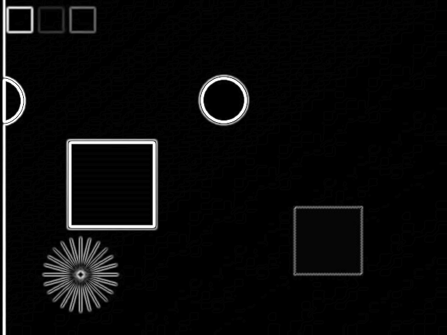
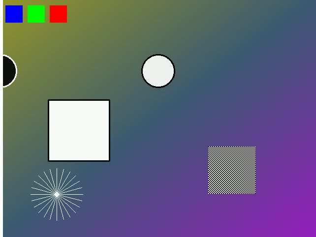
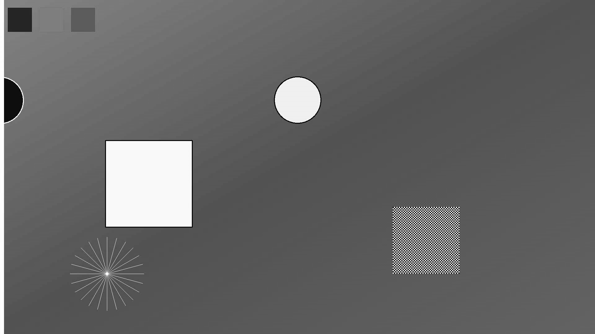
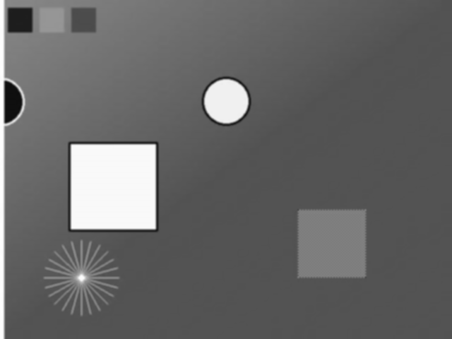
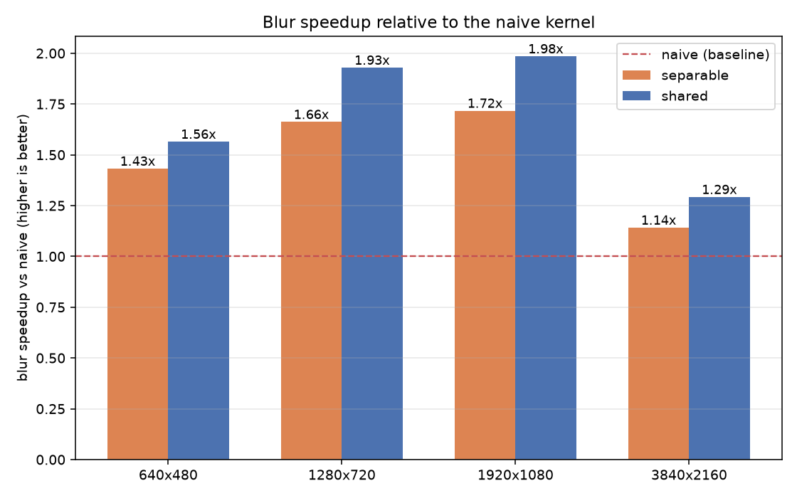

# FrameFlow

A CUDA C++ video processing pipeline with hand-written grayscale, Gaussian blur and Sobel kernels. I implemented the blur three ways — naive, separable, and shared-memory tiled — validated all of them against OpenCV, and benchmarked how each memory optimization affected performance.

OpenCV is used only for video I/O and as the CPU baseline. Every operation on the GPU is a kernel written in this project.



| Original | Grayscale | Blurred | Edges |
|---|---|---|---|
|  |  |  |  |

---

## Performance

RTX 5060 Laptop GPU (Blackwell, `sm_120`), CUDA 12.8, Release build, 1920×1080.

**Gaussian blur — the stage the optimizations target.** From the benchmark sweep:

| variant | ms/frame | vs naive |
|---|---|---|
| naive — direct 2D convolution | 0.182 | — |
| separable — two 1D passes | 0.106 | 1.72× |
| shared — tiled with halo regions | **0.092** | **1.98×** |



**Processing time, all three stages.** Benchmark sweep: median of per-frame samples over repeated passes on in-memory frames, with no video decode in the loop.

| | ms/frame |
|---|---|
| OpenCV CPU baseline (multithreaded SIMD) | 5.686 |
| CUDA kernels, compute only | **0.240** |
| CUDA + PCIe transfer both ways | 0.935 |

**End-to-end video throughput.** A separate run over the full 1080p clip, mean across 200 frames, including CPU decode and encode.

| | ms/frame | rate |
|---|---|---|
| Kernels | 0.319 | |
| + PCIe transfer | 1.170 | |
| **+ decode and encode** | **9.867** | **101 fps** |

The kernel figure differs between the two tables (0.240 vs 0.319 ms) because they are different measurements: the sweep takes a median over repeated passes on cached frames, while the end-to-end run takes a mean with video decode interleaved between frames. Both are real; neither corrects the other.

**On "real-time":** the source is 30 fps and end-to-end throughput is 101 fps, so the pipeline runs at roughly 3.4× real-time including decode and encode. Kernel-only throughput is about 10× higher and describes GPU processing, not pipeline throughput. 4K end-to-end was not measured — the 4K rows in the CSV are compute-only, on resized frames.

Full sweep, 3 variants × 4 resolutions: [results/benchmarks.csv](results/benchmarks.csv), plots in `results/`.

---

## How it works

```
Video decode (CPU, OpenCV → BGR frames)
      ↓
  Host → Device            one upload per frame
      ↓
BGR → Grayscale kernel     d_bgr  → d_gray
      ↓
Blur kernel                d_gray → d_blur     naive | separable | shared
      ↓
Sobel kernel               d_blur → d_edges    naive | shared
      ↓
  Device → Host            one download per frame
      ↓
Video encode (CPU)
```

Device buffers are allocated once and reused across frames. The three kernels chain through device memory, so a frame crosses PCIe exactly twice regardless of how many stages run.

---

## CUDA optimizations

**Naive.** Direct 2D convolution, every tap read from global memory. At 5×5 that is 25 loads per output pixel. A 16×16 block issues 6,400 loads while touching only a 20×20 = 400 pixel region.

**Separable.** A 2D Gaussian is the outer product of two 1D Gaussians, so the K×K convolution becomes a horizontal pass followed by a vertical one — 2K taps instead of K², or 10 instead of 25 at the default size. This is an algorithmic win, independent of memory layout, and the advantage grows with kernel size. It works because the Gaussian is separable; most filters are not.

**Shared memory.** Each block loads its 16×16 tile plus a 2-pixel halo into `__shared__` memory once, synchronizes, then computes from on-chip data. Tiles are ~1.3 KB against 48 KB of shared memory per block, so tile size is bounded by occupancy rather than capacity.

**Constant memory.** Filter weights moved to `__constant__` memory. The tap index is uniform across a warp, which is the access pattern the constant broadcast cache is designed for. This gained 6–10% for the naive and separable variants but up to 47% for the tiled one — plausibly because once image data is in shared memory, weight reads are the main remaining global traffic.

### Result that went the other way

Shared-memory tiling made **Sobel slower**, 0.068 ms against 0.047 ms for the naive version, reproduced across three runs. A 3×3 stencil has much less overlap between neighbouring threads than a 5×5, so there is less reuse to recover, and staging through shared memory adds a load loop, a type conversion and a block-wide barrier. This is consistent with the redundant reads already being served largely from cache, though confirming that would require profiling.

The consequence is that the `shared` variant is marginally slower overall than `separable` (0.240 vs 0.234 ms kernel total), since the Sobel regression cancels the blur gain. The fastest measured combination is shared-memory blur with naive Sobel.

Detailed memory-traffic analysis, kernel-size sweeps and theory-vs-measurement comparison: **[docs/OPTIMIZATION.md](docs/OPTIMIZATION.md)**.

---

## Validation

GPU output is checked three ways.

**Against OpenCV**, with matched kernel size, sigma and `BORDER_REFLECT_101` border handling. Because the CUDA kernels implement the same border mode, the comparison covers the entire image with no excluded pixels.

```
20 frames at 1920x1080, 2,073,600 px/frame, 0 border pixels excluded

stage        mean abs   max abs   px differing >1
Grayscale     0.00002         1                 0
Blur          0.00495         1                 0
Sobel         0.02470         8            15,817     PASSED (tolerance: mean <= 1.0)
```

The Sobel maximum of 8 is inherited rounding, not a defect: the Sobel weights sum to 8 in absolute value, so a one-level difference in the blurred input can move the gradient by up to 8 levels. Blur differs by at most 1 because OpenCV uses fixed-point coefficients.

**Against a NumPy oracle** (`scripts/verify_stages.py`), written from the mathematical definition in float64. OpenCV dispatches to fixed-point SIMD paths that vary by build and CPU, so it is a useful reference but not a bit-exact one. Against NumPy, all three stages are bit-exact.

**Variants against each other** (`scripts/compare_variants.py`), at 642×482 — deliberately not a multiple of the 16×16 block, so partial edge tiles are exercised. Separable and shared agree bit-exactly; naive differs by one level at a single pixel, from floating-point associativity.

---

## Build and run

**Requirements:** NVIDIA GPU and matching driver · CUDA Toolkit 12.x (12.8+ for `sm_120`) · CMake 3.24+ · C++17 compiler (MSVC on Windows — `nvcc` requires it) · OpenCV 4.x with `videoio` · Python 3 with `numpy`, `matplotlib`, `opencv-python`.

```bash
cmake -S . -B build -DCMAKE_BUILD_TYPE=Release
cmake --build build --config Release
```

Targets `sm_120` by default; override with `-DCMAKE_CUDA_ARCHITECTURES=86`. On Windows, add `-DOpenCV_DIR=C:/path/to/opencv/build` if OpenCV is not at `C:/opencv/build`.

Generate a test clip (the repository ships no video files):

```bash
python scripts/generate_test_video.py --output data/sample.mp4 --width 1920 --height 1080 --frames 300
```

```bash
./frameflow --input data/sample.mp4 --output results/edges.mp4 --kernel shared
./frameflow --input data/sample.mp4 --frames 20 --validate
./frameflow --input data/sample.mp4 --benchmark
python scripts/plot_benchmarks.py
```

| Flag | |
|---|---|
| `--input <path>` | source video, required. A single image also works — OpenCV's `VideoCapture` opens one as a one-frame sequence |
| `--output <path>` | destination video; omit to skip encoding |
| `--kernel {naive,separable,shared}` | blur variant, default `shared` |
| `--frames N` | process only the first N frames |
| `--ksize N`, `--sigma S` | blur parameters, default 5 and 1.4 |
| `--warmup N` | untimed warmup iterations, default 30 |
| `--validate` | run the CPU baseline alongside and report error |
| `--benchmark` | sweep variants × resolutions, write CSV |
| `--save-frames`, `--frames-dir D` | dump per-stage PNGs |
| `--debug-sync` | synchronize after every kernel launch |

**Tests.** One command builds and runs every check, exiting non-zero on failure:

```bash
powershell -ExecutionPolicy Bypass -File scripts/build_and_test.ps1
```

Covers correctness against the NumPy oracle at aligned and unaligned resolutions, three-way variant agreement, and argument rejection.

Benchmark numbers were produced with launch-error checking only and no per-launch synchronize, using `cudaEvent` records with one synchronize at the end of the measured region. `--validate` and Debug builds synchronize after every launch instead, and label their timings as unsuitable for benchmarking.

---

## Project structure

```
src/kernels.cu        all CUDA kernels
src/pipeline.cu       device memory, kernel orchestration, event timing
src/main.cpp          CLI and frame loop
src/video_io.cpp      OpenCV decode/encode
src/cpu_baseline.cpp  OpenCV CPU reference
src/benchmark.cpp     resolution × variant sweep
scripts/              test clip generator, verification, plotting, test suite
results/              benchmark CSV, plots, sample frames
```

## Technologies

C++17 · CUDA C++ (Runtime API) · CMake · NVCC · OpenCV (I/O and CPU baseline only) · Python (NumPy, Matplotlib)

## Future work

- **NVDEC/NVENC hardware codecs** — decode and encode are roughly 88% of end-to-end time, making this the highest-value change
- **Pinned memory and CUDA streams** to overlap transfer with compute; PCIe transfer currently costs more than the kernels
- **Nsight Compute profiling** to confirm the cache and memory-throughput explanations above against hardware counters
- **Full Canny** — non-maximum suppression and hysteresis for thin, connected edges
